# Fact Knowledge Layer 🧠

A system that reads PDFs, extracts **qualified numerical facts**, ties every fact to the
exact place it came from in the source page, and then works out where those facts
**corroborate**, **contradict**, or **can be reconciled through context** (time, scope,
units, or definition) — across documents.

It runs **fully offline** on a deterministic extractor — **no API key, no paid service,
no internet needed**. A web UI lets you upload a PDF, watch it merge into the existing
knowledge layer, browse relationships with their **source evidence**, explore the graph
visually, ask questions of the ingested PDFs in plain English, and view or download the
**original PDF with real colour-coded highlights** whose reasoning appears on hover.

### Deployment

> Live Link: https://knowledge-layer-i014.onrender.com
> API Docs : https://knowledge-layer-i014.onrender.com/docs

_(Free-tier host: the first request after idle may take ~30s to wake and, on a cold
instance, rebuild the demo layer — the UI shows a "Building… (n/6)" bar while it does.)_

### Made for

> Built for the Superjoin VIT 2026 Engineering Intern assignment. The starter set is six
> Indian corporate/macro PDFs (Delhivery filings + RBI / IMF / Economic Survey excerpts).
> **Nothing in the extraction or reasoning is specific to them** — upload any PDF.

> **About the optional Groq key:** you do **not** need it. By default there is no key, so
> only the offline heuristic extractor runs and it produces every relationship below. Groq
> is used in two _optional_ places: (1) a second extraction pass that proposes extra
> candidate facts on messy prose — it never decides relationships — and (2) the **Ask** tab,
> which answers plain-English questions over the ingested PDFs' own text. Both degrade
> gracefully with no key: extraction silently returns `[]` for that page and Ask tells you
> what retrieval found without generating an answer. On startup the console prints
> `LLM extractor: False` to confirm it's off.

---

## The four required cases

Each case starts in plain English, then shows the evidence **with exact page references**
and how the engine decides. Every example is **produced live by the running engine** from
the sample PDFs (no curated or hard-coded answers) — a reviewer can click straight to the
cited page and the UI shows a source-evidence crop plus the reasoning. A curated reference
answer for all four is also served at `GET /api/cases?mode=benchmark`, separate from the
live `mode=dynamic` view, so an evaluator can check the live output against a known-good
answer without depending on exactly what's in the DB at that moment.

Sample documents referenced below:
`DECK` = `03-delhivery-q4-fy24-earnings-presentation.pdf` ·
`AR` = `02-delhivery-annual-report-fy24-excerpt.pdf` ·
`PROSPECTUS` = `01-delhivery-prospectus-2022-excerpt.pdf`.

### Case 1 — A fact corroborated across sources, even when written differently

**In plain terms.** The same figure often appears in more than one place, written
differently — with a currency symbol in a headline, as a bare number in a table. A careful
reader treats them as one agreeing fact; so does the system.

**What the engine finds (exact locations).**

- **FY24 revenue = ₹8,142 Cr** — written as **"₹8,142 Cr · FY24 revenue from services"** on
  **`DECK` p6**, and as a bare **"8,142"** in the _Revenue for services (A)_ table on
  **`DECK` p17**.
- **EBITDA = ₹127 Cr** — **"₹127Cr"** on **`DECK` p6** vs **"127" (Reported EBITDA)** on
  **`DECK` p23**.

**How it decides.** Both normalise to the same `(metric = revenue, period = FY24, scope,
unit = crore)` and the same base value; only the representation differs (`₹…Cr` vs a plain
number), so they're **comparable and equal → corroborate**, tagged _"expressed in different
units but equal after normalisation."_

**Honest scope note.** These corroborations are **cross-page within one filing**. True
cross-_document_ corroboration (deck ↔ annual report) is currently limited by the
metric-ontology gap in **Limitations** — we don't fake it.

### Case 2 — A genuine or likely contradiction

**In plain terms.** Sometimes two statements about the same thing genuinely disagree, with
no innocent explanation.

**What the engine finds (exact location).** On **`PROSPECTUS` p1**, the offer size is stated
as **₹40,000.00 million** and as **₹12,350.00 million** — both under the same note
**"\*Subject to finalization of the Basis of Allotment."**

**How it decides.** Both facts share `(metric, period = May-2022, scope)` and the same
currency unit, but their base values (**₹4,000 Cr vs ₹1,235 Cr**) differ by ~69%, and **no**
period/unit/definition/scope difference explains it. Exactly two conflicting values under
identical qualifiers → **contradiction** (a real draft-vs-final artefact inside one
document).

### Case 3 — An apparent contradiction explained by context

**In plain terms.** Two numbers can look contradictory but aren't — same quantity, different
period / unit / definition. The system names the one dimension that differs and reconciles
them.

**What the engine finds (exact locations).**

- **By definition** — EBITDA **₹127 Cr (reported)** vs **₹76 Cr (adjusted)**, both on
  **`DECK` p6** → _reconciled by DEFINITION._
- **By period** — EBITDA **₹127 Cr (FY24, `DECK` p6)** vs **₹46 Cr (Q4 FY24, `DECK` p7)** →
  _reconciled by PERIOD._
- **By unit (the classic)** — the normalizer proves **₹8,142 Cr** (`DECK` p6) ≡
  **₹81,415.38 million** (`AR` p22): ₹81,415.38 M ÷ 10 = ₹8,141.5 Cr ≈ ₹8,142 Cr, so an
  apparent order-of-magnitude clash collapses to a match (demonstrated by the normalization
  layer and the test suite).

**How it decides.** The two facts match on base metric but differ on exactly one qualifier —
`definition = reported vs adjusted`, `period = FY vs quarter`, or `unit = crore vs million` —
so the engine emits **reconciled** and records _which_ dimension explains the gap.

### Case 4 — An extraction or reasoning failure, and how it's handled

**In plain terms.** No extractor is perfect; being honest about the failure modes — and
handling them safely — matters more than pretending they don't exist.

**Handled correctly (a positive edge case):** accounting **parentheses are read as
negatives** — e.g. _Adjusted EBITDA_ **(404)** on **`DECK` p14** is stored as **−404 Cr**,
not +404, so loss-making periods reason correctly (verified in the UI and the test suite).

**Known failures, handled by staying silent rather than wrong:**

- **Cross-wording of the same entity.** The deck's **"Partner centers (constellation/BAs)" =
  939 (`DECK` p8)** and the annual report's **"Partner Delivery Centres" = 938 (`AR` p47)**
  are the same metric on the same date (31 Mar 2024), but different strings, so they don't
  currently cluster into one contradiction. We deliberately **don't** bridge this with
  permissive string rules (floods false matches) or a hard-coded synonym (defeats
  generalization) — it's the top item in **Limitations** (a metric ontology).
- **Chart-only values** with no adjacent unit/period are withheld from reasoning so they
  can't form false relationships.
- **Parsing-noise guard:** if 3+ distinct values collide on one `(metric, period, scope)`,
  it's treated as an artefact and **skipped** rather than reported as a contradiction.
- **Column-reordering in footnote-formula tables** (e.g. a proforma statement where column D
  is printed before column C) is a known, _unresolved_ failure mode — flagged honestly in
  `GET /api/cases?mode=benchmark` rather than claimed as solved.

---

## Workflow — how a PDF becomes reconciled knowledge

The diagram in the next section shows the pipeline as boxes; here is the same journey in
words, following a single number from a page all the way to a relationship card. Every stage
is a separate, testable module (see _Component architecture_), and each one only ever hands
the next a cleaner, more structured version of the same fact.

1. **Ingest (`ingest.py`).** `POST /api/upload` (or the first-run auto-seed) hands the PDF to
   PyMuPDF, which walks every page and emits _text lines with bounding boxes_ and detected
   _table cells_. Each page is wrapped in its own `try/except`, so one broken page never
   aborts the document; an optional `?max_pages=` caps the scan and the reply reports
   `total_pages` / `pages_processed` / `is_truncated`.

2. **Extract candidate facts (`extract.py`, optional `extract_llm.py`).** The heuristic
   extractor — always on, offline — reads lines, captions, tables and period-column grids and
   proposes _qualified facts_: `{ metric, value, unit, period, scope, evidence(page, bbox,
quote) }`. If `GROQ_API_KEY` is set, an optional Groq pass proposes extra candidates from
   messy prose. The LLM only ever _proposes_; it never classifies a relationship.

3. **Ground every fact (`ground.py`).** The claimed number must actually appear in its cited
   evidence span. Anything that fails is flagged **ungrounded** and kept out of reasoning.
   This is the hallucination check — and it's why the UI can render a real source crop behind
   every fact.

4. **Normalize (`normalize.py`).** Raw strings like `₹(452) Cr`, `81,415.38 million`,
   `FY2024-25`, `Q4 FY24`, `as on March 31 2024` become structured, comparable objects: a
   `currency / mass / percent / count` **dimension** with the value in a common base (crore,
   tonne, %), an **Indian-fiscal-aware period**, and a **scope** (basis / segment /
   definition). **Two facts are only ever compared after this step** — that's what stops a
   quarter being matched to a full year, or crore to million.

5. **Store, incrementally (`db.py`).** Facts, relationships and page-text chunks are written
   to SQLite (WAL mode). Documents de-duplicate by **content hash** and facts by a
   **content-hashed id**, so re-uploading the exact same PDF changes nothing.

6. **Reconcile — only what changed (`reconcile.py`).** Facts are grouped by `metric_key`, and
   within each `(period, scope, unit)` cell the engine compares them mechanically: values
   **agree → corroborate**; **disagree with nothing to explain it → contradict**; **differ on
   exactly one dimension → reconciled**, naming it (`definition` / `period` / `basis` /
   `unit` / `vintage`). Crucially, only the metric keys _this_ document touched are
   re-reconciled — the rest of the graph is left untouched, which is what lets the layer scale
   to many PDFs without an $O(N^2)$ rebuild.

7. **Serve & explore (`main.py`, `evidence.py`, `rag.py`, frontend).** The result surfaces
   five ways: **relationship cards** with evidence crops + plain-English reasoning; a **Vis.js
   physics graph**; the **annotated-PDF viewer & download** with hover reasons; a
   **searchable facts browser**; and the **Ask** tab (BM25 retrieval over the same page text,
   answers cite `(document, page)`).

You can watch this whole pipeline run: on a cold start the app seeds the six sample PDFs
through exactly these steps, and the UI shows a **"Building the knowledge base… (n/6)"** bar
until all six are in — after which the tally jumps to the full counts and every tab is live.

---

## System flow

```mermaid
flowchart TD

    subgraph S1 [" 📂 1. DOCUMENT INGESTION "]
        A["📄 <b>PDF Document Upload</b><br/><code>POST /api/upload?max_pages=</code>"] --> B["📐 <b>PyMuPDF Parser</b><br/>Page Text + BBox · Tables · Per-Page Error Isolation"]
    end

    subgraph S2 [" 🧠 2. GROUNDED FACT EXTRACTION "]
        C["⚡ <b>Groq LLM Fact Engine (optional)</b><br/><i>429 Quota Circuit Breaker · 60s Cooldown</i>"]
        E["⚙️ <b>Heuristic Rule Matcher</b><br/>Always Runs · Offline · Quota Safe"]
        D["📋 <b>Ground-Truth Verifier</b><br/>Value Must Appear in Cited Evidence"]
        C -->|Primary Stream| D
        C -->|Cooldown Fallback| E
        E --> D
    end

    subgraph S3 [" 💾 3. KNOWLEDGE PERSISTENCE "]
        F[("🗄️ <b>SQLite Knowledge Store</b><br/>WAL Mode · Facts · Relationships · Text Chunks")]
    end

    subgraph S4 [" ⚖️ 4. INCREMENTAL RECONCILIATION ENGINE "]
        G["🔍 <b>Touched-Metric-Key Selector</b><br/><i>Only Re-Reconciles What Changed</i>"] --> H["🔬 <b>Cross-Document Analysis</b><br/>Unit · Period · Definition · Basis Disambiguation"]
    end

    subgraph S5 [" 🎯 5. RELATIONSHIP CLASSIFICATION "]
        R1["≈ <b>Corroborated</b><br/>Case 1: Same Value, Agreeing Sources"]
        R2["≠ <b>Genuine Contradiction</b><br/>Case 2: Same Scope, Values Disagree"]
        R3["≠* <b>Contextual Reconciliation</b><br/>Case 3: Unit / Period / Definition Variance"]
    end

    subgraph S6 [" 🚀 6. SERVING & EXPLORATION LAYER "]
        Z1["🕸️ <b>Vis.js Physics Graph</b><br/>Facts as Nodes · Relationships as Edges"]
        Z2["📑 <b>4-Case Dynamic + Benchmark Docket</b><br/><code>GET /api/cases?mode=</code>"]
        Z3["💬 <b>BM25-Retrieved, Source-Cited Q&A</b><br/><code>POST /api/ask</code>"]
        Z4["🖍️ <b>Annotated PDF Viewer & Export</b><br/>Hover-to-Explain Highlights"]
    end

    %% Direct Node-to-Node Pipeline Flow
    B --> C
    D --> F
    F --> G

    H -->|Consistent Values| R1
    H -->|Direct Discrepancy| R2
    H -->|Unit / Scope Variance| R3

    R1 & R2 & R3 --> S6
    F -.->|page-text chunks| Z3

    %% Elevated Card Subgraph Styling (High Contrast in Dark & Light Modes)
    style S1 fill:#1e293b,stroke:#0284c7,stroke-width:2px,rx:10px
    style S2 fill:#1e293b,stroke:#7c3aed,stroke-width:2px,rx:10px
    style S3 fill:#1e293b,stroke:#d97706,stroke-width:2px,rx:10px
    style S4 fill:#1e293b,stroke:#059669,stroke-width:2px,rx:10px
    style S5 fill:#1e293b,stroke:#db2777,stroke-width:2px,rx:10px
    style S6 fill:#1e293b,stroke:#4f46e5,stroke-width:2px,rx:10px

    %% Vibrant Solid Color Cards with Crisp White Text
    classDef blueCard fill:#0284c7,stroke:#38bdf8,stroke-width:2px,color:#ffffff,font-weight:bold,rx:8px,ry:8px;
    classDef purpleCard fill:#7c3aed,stroke:#a78bfa,stroke-width:2px,color:#ffffff,font-weight:bold,rx:8px,ry:8px;
    classDef amberCard fill:#d97706,stroke:#fbbf24,stroke-width:2px,color:#ffffff,font-weight:bold,rx:8px,ry:8px;
    classDef greenCard fill:#059669,stroke:#34d399,stroke-width:2px,color:#ffffff,font-weight:bold,rx:8px,ry:8px;
    classDef corrobCard fill:#16a34a,stroke:#4ade80,stroke-width:2px,color:#ffffff,font-weight:bold,rx:6px,ry:6px;
    classDef contradCard fill:#dc2626,stroke:#f87171,stroke-width:2px,color:#ffffff,font-weight:bold,rx:6px,ry:6px;
    classDef reconcCard fill:#9333ea,stroke:#c084fc,stroke-width:2px,color:#ffffff,font-weight:bold,rx:6px,ry:6px;
    classDef indigoCard fill:#4f46e5,stroke:#818cf8,stroke-width:2px,color:#ffffff,font-weight:bold,rx:8px,ry:8px;

    class A,B blueCard;
    class C,D,E purpleCard;
    class F amberCard;
    class G,H greenCard;
    class R1 corrobCard;
    class R2 contradCard;
    class R3 reconcCard;
    class Z1,Z2,Z3,Z4 indigoCard;

    %% High-Contrast Cyan Connecting Edges
    linkStyle default stroke:#38bdf8,stroke-width:2px;
```



> GitHub renders Mermaid natively in `.md` files. If you're viewing this somewhere that
> doesn't, paste the block above into https://mermaid.live to see it rendered.

---

## How this submission answers the brief

### "Before You Submit" checklist

- ☑ **Runs from these instructions and accepts new PDFs through an API or UI** — one command
  (or `python main.py`); upload via the header button (**UI**) or `POST /api/upload` (**API**),
  optionally capped with `?max_pages=` for a quick partial scan.
- ☑ **Results contain facts, source evidence, and cross-document relationships** — a
  searchable facts browser, an evidence crop behind every fact, colour-coded relationship
  cards, a physics graph view, and an explicit `cross-document` flag.
- ☑ **Demonstrates the four required cases** — the section above, all live in the UI and at
  `GET /api/cases`.
- ☑ **Approach documented + demo video ≤ 3 min** — this README + `DEMO_SCRIPT.md`; paste
  your video link under **Video demo**.
- ☑ **Credentials kept out of the repo; runs without a paid account** — `.env` is
  git-ignored and `sample_output/` holds real, keyless output.

### Brownie points — what actually works

- **Incremental, no rebuild** ✅ — uploading a PDF re-runs reconciliation **only for the
  metric keys it touched**; existing knowledge is untouched.
- **Many PDFs in one layer** ✅ — a single SQLite store (WAL mode) keyed by
  `(metric, period, scope)`; re-uploading identical content is de-duplicated by content hash.
- **A schema that evolves dynamically** ✅ — metrics, periods, scopes and qualifiers are
  **open vocabularies read from each document**; a new kind of fact needs no schema change.
- **Large PDFs without falling over** ✅ (with a caveat) — streaming per-page ingest,
  per-page and per-fact error isolation, and an optional `max_pages` cap (with the scan
  depth reported back as `total_pages` / `pages_processed` / `is_truncated`) mean one bad
  page never aborts a document; very large scanned PDFs are slower and need OCR (see
  Limitations).
- **Ask your documents a question** ✅ — the **Ask** tab runs BM25 lexical retrieval over
  every ingested page's text and answers with a Groq call constrained to cite
  `(document, page)` for every claim; retrieval works even without a Groq key.
- **Explore the graph, not just cards** ✅ — the **Graph** tab renders every
  relationship-bearing fact as a Vis.js physics-simulated node graph, edges coloured by
  relationship type.

---

## Setup and run instructions

**Prerequisites:** Python 3.10+ (tested on 3.12). No API key required.

### One command (macOS / Linux / Git Bash / WSL)

```bash
./run.sh
```

Creates a virtualenv, installs dependencies, builds the demo knowledge base from
`sample_pdfs/` (offline), and serves at **http://localhost:8000**.

### Windows (PowerShell / Command Prompt)

`run.sh` is a bash script; on plain Windows run the equivalent steps:

```powershell
python -m venv .venv
.venv\Scripts\activate
pip install -r requirements.txt
cd backend
python main.py
```

Then open **http://localhost:8000** (interactive API docs at **/docs**).

The **first launch auto-seeds** the knowledge base from `sample_pdfs/` if it's empty
(~10–20s; you'll see `[startup] seeding …` in the console), so `python main.py` alone gives
a fully working demo with real evidence crops — no separate step needed.

Notes:

- `--host 0.0.0.0` in the log is the _bind_ address — always open **localhost**, not
  `0.0.0.0`, in the browser.
- A console line like _"Consider using the pymupdf_layout package…"_ is a harmless optional
  notice from PyMuPDF, not an error.

> **Troubleshooting — evidence crops show as 404 / broken images, or the Facts tab is
> empty:** your `knowledge.db` was created empty by an older run. Stop the server, delete
> `backend/knowledge.db`, and run `python main.py` again — it rebuilds the layer from the
> sample PDFs and everything renders. (`knowledge.db` is disposable and git-ignored; it's
> always rebuilt from the PDFs.) A quick way to confirm the layer is real and not the
> shipped fallback: open `/api/stats` — it should show `documents: 6`, `facts: 405`, and
> **no** `"source": "sample"` field.
>
> **Troubleshooting — `sqlite3: unable to open database file`:** the project is in a
> read-only/synced folder (OneDrive, Desktop, network drive). Move it to a plain local path
> like `C:\dev\fact-knowledge-layer` and rerun.
>
> **Troubleshooting — deployed on a free-tier host (e.g. Render) and data keeps
> resetting:** free-tier disks are usually ephemeral — `knowledge.db` gets wiped on every
> restart/redeploy and rebuilt by auto-seed. If you need uploads to persist across deploys,
> use the host's persistent-disk option; otherwise treat every restart as a fresh demo.

### Deploy on a free host (Render)

This repo includes a `render.yaml` blueprint. In Render: **New → Blueprint → connect this
repo → Apply**. It sets the build to install deps **and pre-seed** the demo layer
(`python seed_demo.py`), the start command to `uvicorn main:app --host 0.0.0.0 --port $PORT
--app-dir backend`, and the health check to `/api/ready`. To enable the **Ask** tab in
production, add `GROQ_API_KEY` under the service's **Environment** tab and redeploy; confirm
at `/api/llm-status`.

### Optional: enable the Groq LLM extractor and the Ask chatbot

The heuristic extractor always runs, and the **Ask** tab always retrieves even without a
key. To add the optional LLM extraction pass and enable Ask's generated answers:

```bash
cp .env.example .env
# set GROQ_API_KEY=...  (free key: https://console.groq.com/keys)
# GROQ_MODEL defaults to openai/gpt-oss-120b  (Groq free tier)
```

Make sure `groq` is in `requirements.txt` (this project uses the plain `groq` SDK directly —
no LangChain dependency, which avoids version-resolution conflicts on newer Python builds).
Restart the server. The LLM only **proposes** facts during extraction; it never classifies
relationships, and its output is grounded and cached exactly like the heuristic path. For
Ask, a Groq rate-limit response trips a shared cooldown so extraction and Q&A don't hammer a
throttled key back-to-back.

---

## Video demo

**Demo video (≤ 3 min):** _[paste your Loom / YouTube link here]_

A click-by-click narration is in **`DEMO_SCRIPT.md`**: the classification tally → the
contradiction card with two evidence crops → the two EBITDA reconciliations (definition +
period) → the revenue corroboration → the physics graph view → asking the chatbot a
question and seeing its page citations → uploading a new PDF that merges in → the annotated
document viewer with hover-to-explain highlights and the downloadable annotated PDF.

---

## Approach and architecture

### What counts as a fact

A fact is a **qualified measurement**, not a loose number:

```
{ metric, value, unit, period, scope, qualifiers, evidence(doc, page, bbox, quote) }
```

Two facts are **comparable only when** their `(metric, period, scope, unit)` align after
normalization. That one rule is what makes the reasoning trustworthy: we never compare a
quarter to a full year, a margin to an absolute, or crore to million by accident.

### Component architecture

```
backend/
  ingest.py      PDF → lines+bbox, tables; page-scan depth cap + per-page isolation
  extract.py     heuristic extractors: line/caption reader, table reader, grid reader
  extract_llm.py optional Groq extractor (grounded + disk-cached; 429 circuit breaker;
                 returns [] with no key or on cooldown)
  rag.py         Ask tab: BM25 retrieval over stored page-text chunks + a Groq call
                 constrained to cite (document, page); shares the 429 breaker with
                 extract_llm.py; degrades to "retrieval only" with no key
  normalize.py   units (crore/mn/lakh…), periods (Indian FY, quarter, snapshot), scope,
                 canonical metric names, monetary-currency inference
  ground.py      verify the claimed number actually appears in its cited evidence
  reconcile.py   deterministic corroborate / contradict / reconcile + incremental update
  models.py      Fact & Relationship dataclasses (stable schema, content-hashed ids)
  db.py          SQLite store (WAL mode); thread-safe; facts, relationships, and RAG chunks;
                 incremental reconciliation by metric key
  evidence.py    render evidence crops, page images, and the annotated highlighted PDF
  pipeline.py    ingest → extract → ground → store (facts + chunks) → reconcile
  main.py        FastAPI app + endpoints; auto-seeds from sample_pdfs/ on first run
  seed_demo.py   rebuild the KB + sample_output/ from sample_pdfs/
  test_system.py end-to-end verification suite (offline, isolated DB)
frontend/        index.html · style.css · app.js  (no build step, vanilla JS + Vis.js CDN)
```

### Key decisions and trade-offs

- **Reasoning is the product, not the graph.** The brief warns a graph DB or visualization
  "alone is not the solution," so the effort goes into _grounding, comparison and
  explanation_ first. The relationship engine is **deterministic and explainable**; storage
  is plain SQLite. The Vis.js graph and the Ask chatbot are _serving-layer_ additions on top
  of that reasoning, not a substitute for it — every edge in the graph and every citation
  in a chat answer traces back to the same grounded facts and page text.
- **LLM proposes, rules decide.** LLMs are good at _finding_ candidate numbers in prose but
  unreliable at deciding whether two figures truly conflict. So the (optional) LLM only
  extracts; transparent rules classify — reproducible, and every edge is explainable.
- **Retrieval before generation, always.** The Ask chatbot never answers from the model's
  own knowledge — it retrieves page-text chunks via BM25 first and only asks Groq to
  summarize _those_ excerpts with citations. If retrieval finds nothing, or Groq is
  unavailable, the UI says so instead of guessing.
- **Grounding you can see.** Every fact stores page + bounding box; the UI re-opens the PDF
  and renders that exact region, so a reviewer verifies a number without trusting the model.
- **Three extraction layers, one schema:** a geometry-aware line/caption reader (maps slide
  tiles like `₹127Cr / 1.6%` to `EBITDA / EBITDA margin`), PyMuPDF `find_tables`, and a
  custom **period-column grid reader** that recovers KPI/operating-metric values (pin-code
  reach, partner-centre series) where period headers sit far above their data columns.
- **Normalization is where contradictions are won or lost.** Crore/million/lakh, fiscal
  quarters vs calendar dates, reported/adjusted/standalone/consolidated — all converted to a
  common base with scope/definition recorded, so `₹8,142 Cr` vs `₹81,415 M` reconciles
  instead of firing a false contradiction.
- **Precision over recall in reasoning.** Hundreds of facts, but only well-typed level
  measurements enter reasoning; growth deltas and un-anchored integers are stored yet
  excluded, and a genuine contradiction needs _exactly two_ distinct values — yielding a
  small, high-signal relationship set instead of thousands of spurious edges.

### AI tools used

Designed and implemented with an AI coding assistant (Anthropic Claude) for architecture,
implementation and precision-tuning. The **optional runtime LLM** is **Groq**
(`openai/gpt-oss-120b`, free tier) via the plain `groq` Python SDK, used for candidate-fact
extraction and for generating cited answers in the Ask tab — never for classifying
relationships, which stay fully rule-based.

---

## Why it generalizes (no hard-coding)

- **No company names, filenames, or document-specific rules** in the extraction or
  reconciliation logic. The _frame_ of a fact is fixed; the _vocabulary_ is discovered per
  document.
- Any PDF at `POST /api/upload` flows through the same pipeline and merges into the same
  layer, and its text becomes searchable by the Ask chatbot immediately.
- Seeded facts exist only for a zero-setup demo; they're regenerated from the PDFs by the
  auto-seed / `seed_demo.py`, never committed as ground truth.

---

## Using the interface

- **Classification tally (hero):** live counts of corroborations / contradictions /
  reconciliations; click a tile to filter.
- **Relationships:** colour-coded cards (green / red / amber) with both facts, each with a
  **source evidence crop**, the reconciliation **dimension** chip, and a plain-English **Why**.
- **Graph:** every relationship-bearing fact as a node in a Vis.js physics simulation, edges
  coloured green (corroborate) / red (contradict) / amber-dashed (reconciled); hover an edge
  for the reasoning, drag nodes, scroll to zoom.
- **Annotated documents:** pick a document to see its pages with colour-coded highlight
  boxes over every relationship-bearing fact; **hover** to read the reasoning and the
  counterpart. **Download annotated PDF** exports the _real_ source PDF with genuine
  highlight annotations coloured by type and the reasoning embedded as each highlight's hover
  note (works in any PDF viewer).
- **Facts:** searchable browser over every grounded fact.
- **Ask:** a chat box — ask questions in plain English about the ingested PDFs; answers cite
  `(document, page)` for every claim, with source chips linking back to the evidence.
- **Add a PDF:** upload from the header; progress shows, the new document **merges** into the
  layer, and the whole view refreshes.

### REST API

| Method & path                     | Purpose                                                                                      |
| --------------------------------- | -------------------------------------------------------------------------------------------- |
| `POST /api/upload`                | Ingest a PDF (`?max_pages=` optional); extract → ground → store → reconcile incrementally    |
| `GET /api/status`                 | Progress of the most recent upload, including page-scan truncation info                      |
| `GET /api/ready`                  | Readiness probe — `true` once the first-run seed has finished                                |
| `GET /api/facts?metric_key=`      | All grounded facts (optionally by metric)                                                    |
| `GET /api/relationships?type=`    | Reconciliation results, enriched with both facts                                             |
| `GET /api/cases?mode=`            | The four required cases — `dynamic` (live from the graph) or `benchmark` (curated reference) |
| `POST /api/ask`                   | Ask a question over ingested PDFs; BM25 retrieval + cited Groq answer                        |
| `GET /api/stats`                  | Counts by relationship type                                                                  |
| `GET /api/documents`              | Ingested documents                                                                           |
| `GET /api/evidence/{fact_id}`     | PNG crop of the source region behind a fact                                                  |
| `GET /api/page/{doc_id}/{page}`   | Full page render (behind the annotation overlay)                                             |
| `GET /api/annotations/{doc_id}`   | Colour-coded boxes + reasons for a document's pages                                          |
| `GET /api/annotated-pdf/{doc_id}` | Download the source PDF with real highlights + hover reasons                                 |

---

## Verification test suite

Run the full end-to-end suite anytime (offline, ~15s):

```bash
cd backend
python test_system.py
```

**How it runs.** The script sets `KB_DB` to a throwaway path in your temp folder, imports
the app and **auto-seeds that isolated database** from `sample_pdfs/` — your real
`knowledge.db` is never touched — then drives the live app with FastAPI's `TestClient` and
calls the normalization / reconciliation functions directly. It runs **34 checks across five
suites**, prints a per-check ✓/✗ report, and **exits non-zero on any failure** (so it can
gate CI).

**What passes, and why it matters:**

1. **REST API endpoints** — `/api/stats`, `/api/facts`, `/api/relationships`,
   `/api/documents`, `/api/evidence/{id}` (real → PNG, bogus → clean 404), `/api/page`,
   `/api/annotations`, `/api/annotated-pdf` (returns a real `%PDF`), and the static UI.
2. **Financial normalization** — crore / million→crore / billion / lakh / thousand /
   tonnes / percent, accounting-parentheses negatives `(4,157.43) → −4157.43`, and the
   headline unit reconciliation `₹8,142 Cr ≡ ₹81,415.38 M`.
3. **Reconciler engine** — asserts the four required cases are produced **live**: a
   corroboration; the ₹40,000M vs ₹12,350M contradiction; EBITDA reconcile-by-definition
   (127 vs 76) and reconcile-by-period (127 vs 46); plus the precision guard that keeps
   contradictions rare.
4. **Incremental / de-duplication** — re-ingesting identical content adds no duplicate
   document, facts, or relationships, and reconciliation is scoped to touched metric keys.
5. **Grounding & coverage** — every stored fact is grounded (its digits actually appear in
   the quoted evidence), all three relationship types are present, and reconciliations span
   multiple explanatory dimensions.

**Result (from a clean run):**

```text
=== Suite 1 · REST API endpoints ===            ✓ 10/10
=== Suite 2 · Financial number normalization === ✓ 11/11
=== Suite 3 · Reconciler engine (four cases) === ✓  5/5
=== Suite 4 · Incremental & de-duplication ===   ✓  4/4
=== Suite 5 · Grounding & case coverage ===      ✓  4/4
============================================================
RESULT: 34/34 checks passed — ALL PASSED ✅
============================================================
```

---

## Limitations and Next Steps

Honest, per the brief — what doesn't work yet, and what we'd build next.

- **Cross-wording entity matching (metric ontology).** We reconcile numbers when metric
  _strings_ align after normalization, but not yet when two documents name the same
  real-world entity differently — e.g. the deck's _"Partner centers (constellation/BAs)"_ vs
  the annual report's _"Partner Delivery Centres."_ Bridging these needs a light metric
  ontology / embedding matcher; permissive string rules flood false matches and hard-coding
  the synonym would defeat the point. **This is the next thing to build**, and it would
  unlock more cross-document cases (e.g. the 939 vs 938 partner-centre count).
- **Chart/image OCR.** Values living only inside a chart image with no adjacent text aren't
  extracted (PyMuPDF reads the text layer). A Tesseract/vision pre-pass would help.
- **Textual, not semantic, grounding.** We verify the claimed number appears in the cited
  region; we don't yet verify the surrounding sentence _means_ what the metric label says.
- **Ask retrieval is lexical, not semantic.** BM25 matches on shared vocabulary; a question
  phrased very differently from the source text (heavy paraphrase, synonyms with no term
  overlap) may retrieve weaker context than an embeddings-based retriever would. No vector
  DB or embeddings API is used, by design — it keeps the system credential-free by default.
- **Column-reordering in footnote-formula tables** (matching columns by their stated formula,
  e.g. `E = C + D`, rather than by left-to-right position) is not implemented — flagged, not
  silently mishandled.
- **Single-hop reasoning.** Reconciliation compares pairs; multi-hop deduction ("A implies X,
  B implies Y, so C is impossible") is future work.
- **Very large scanned PDFs** are slower and, without OCR, low-yield.

**Planned next:** the metric-ontology matcher above; an optional embeddings-based retriever
for Ask; a confidence model for borderline contradictions; and in-browser bbox highlighting
on a zoomable PDF canvas.

---

## Additional notes

- **Deterministic and reproducible.** The relationship set is exactly what the rules produce
  from the facts — no benchmark answers baked into the live path, no curated ground truth.
  That honesty is what makes it trustworthy on documents it has never seen.
- **Runs without credentials.** The full experience — extraction, grounding, reconciliation,
  UI, graph view, annotated pages, and the downloadable highlighted PDF — works offline; Ask's
  retrieval also works offline. Groq generation is a bonus, not a dependency.
- **Repo hygiene.** `.env`, the built `knowledge.db`, uploads and caches are git-ignored;
  `sample_output/` holds real keyless output (facts, relationships, stats, and the case
  benchmark) for evaluation.

### Suggested git flow

```bash
git init && git add .
git commit -m "Fact Knowledge Layer: extraction, grounding, cross-doc reconciliation, graph, RAG chatbot, UI"
# create an empty GitHub repo, then:
git remote add origin <your-repo-url>
git branch -M main && git push -u origin main
```
